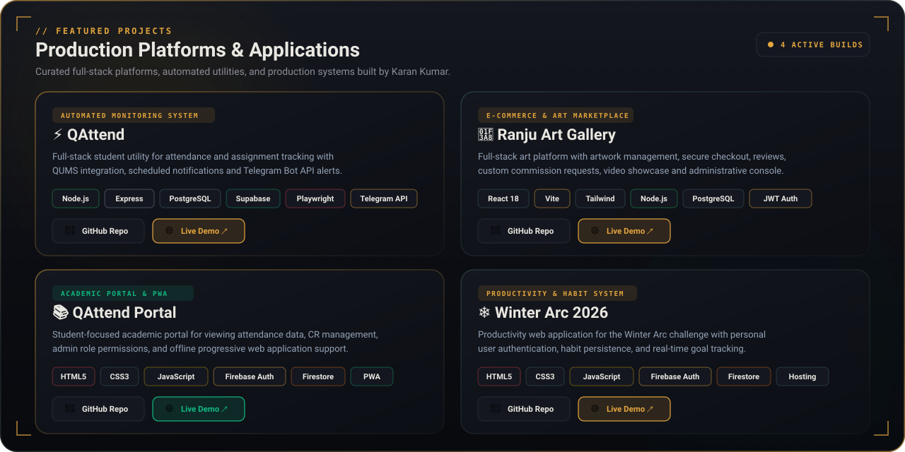
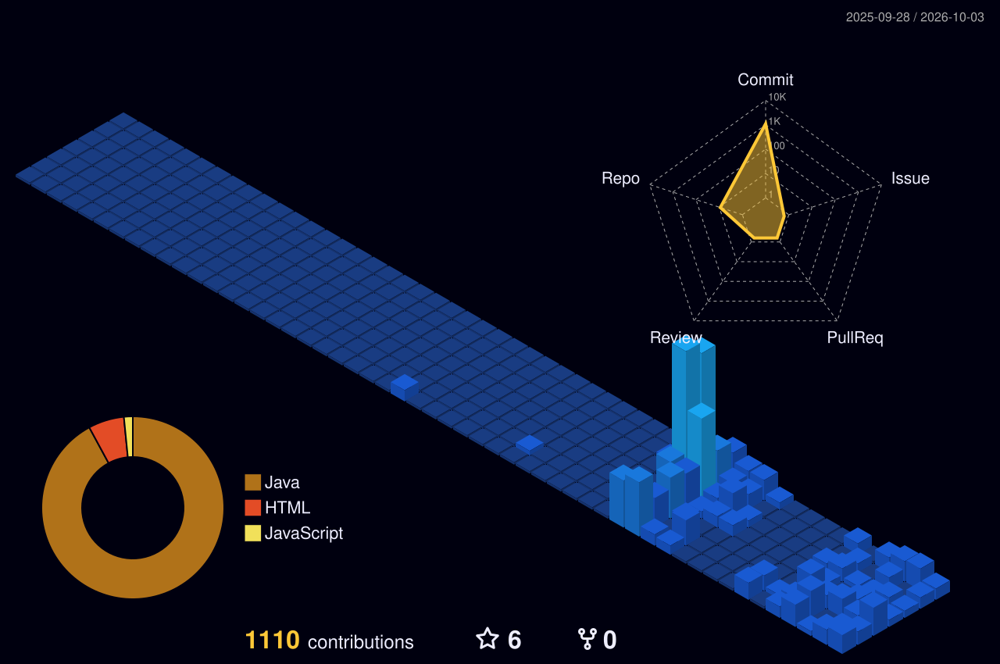

<!-- ═══════════════════════════════════════════════════════════════════ -->
<!-- 🚀 SECTION 1 — HERO -->
<!-- ═══════════════════════════════════════════════════════════════════ -->

  

<!-- ═══════════════════════════════════════════════════════════════════ -->
<!-- 🧭 SECTION 2 — ABOUT / DEVELOPER + LIFE OUTSIDE CODE -->
<!-- ═══════════════════════════════════════════════════════════════════ -->

  

<!-- ═══════════════════════════════════════════════════════════════════ -->
<!-- ⚡ SECTION 3 — TECHNOLOGIES & LIBRARIES -->
<!-- ═══════════════════════════════════════════════════════════════════ -->

  

<!-- ═══════════════════════════════════════════════════════════════════ -->
<!-- 🪪 SECTION 4 — ENGINEERING ACTIVITY / GITHUB DASHBOARD -->
<!-- ═══════════════════════════════════════════════════════════════════ -->

  

<!-- LIVE GITHUB ACTIVITY METRICS -->

  
  &nbsp;
  

  

  

  

<!-- ═══════════════════════════════════════════════════════════════════ -->
<!-- 🛠️ SECTION 5 — FEATURED PROJECTS -->
<!-- ═══════════════════════════════════════════════════════════════════ -->

 

<!-- QUICK ACCESS PROJECT LINKS -->

  
  &nbsp;
  
  &nbsp;&nbsp;&nbsp;&nbsp;|&nbsp;&nbsp;&nbsp;&nbsp;
  
  &nbsp;
  

  
  &nbsp;
  
  &nbsp;&nbsp;&nbsp;&nbsp;|&nbsp;&nbsp;&nbsp;&nbsp;
  
  &nbsp;
  

  

<!-- ═══════════════════════════════════════════════════════════════════ -->
<!-- 🏙️ SECTION 6 — 3D CONTRIBUTION CITY & SNAKE -->
<!-- ═══════════════════════════════════════════════════════════════════ -->

  // CONTRIBUTION ACTIVITY 
  3D Contribution City 
  <i>Every commit builds another tower — automatically rendered daily via GitHub Actions</i>

  

  // COMMIT GRAPH DYNAMICS 
  🐍 Contribution Snake

<picture>
  <source media="(prefers-color-scheme: dark)" srcset="https://raw.githubusercontent.com/karansin003/karansin003/output/github-snake-dark.svg"/>
  <source media="(prefers-color-scheme: light)" srcset="https://raw.githubusercontent.com/karansin003/karansin003/output/github-snake.svg"/>
  
</picture>

  

<!-- ═══════════════════════════════════════════════════════════════════ -->
<!-- 🌐 SECTION 7 — LET'S CONNECT -->
<!-- ═══════════════════════════════════════════════════════════════════ -->

 

  
  &nbsp;
  
  &nbsp;
  
  &nbsp;
  
  &nbsp;
  
  &nbsp;
  

 

<!-- PROFILE VIEWS COUNTER -->

  

<!-- ═══════════════════════════════════════════════════════════════════ -->
<!-- 🏷️ SECTION 8 — FOOTER -->
<!-- ═══════════════════════════════════════════════════════════════════ -->

